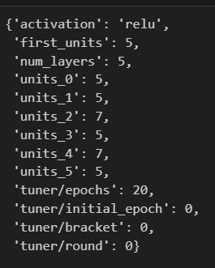

# nonprofit-funding
Deep Learning - Data Analytics Course Module 21

# Overview
The purpose of this analysis is to predict whether funding applicants will be successful if funded by the nonprofit Alphabet Soup. The dataset is in a CSV containing more than 34,000 organizations that have already received funding from this nonprofit.

# Results

 - Data Preprocessing
    - The 'is_successful' column would be a good target variable for this model.
    - There are two columns that can be removed as they are merely identifiers: EIN and Name
    - There are 43 other columns which would be useful features for this model.

 - Compiling, Training, and Evaluating the Model
    
    - Initial Model:  first hidden layer (3 units, relu activation), second hidden layer (3 units, relu activation), output layer (1 unit, sigmoid activation) >> Accuracy: 0.7258

    - Optimization 1: first hidden layer (10 units, relu activation), second hidden layer (5 units, relu activation), output layer (1 unit, sigmoid activation) >> Accuracy: 0.7286

    - Optimization 2: I used KerasTuner to automate the process of finding the best hyperparameters. It achieved an accuracy of 0.7336
  
      
    
    - Optimization 3: Using the hyperparameters above, I created additional layers and experimented with the number of epochs, trying first 20, then 75 and then 100 >>  Accuracy: 0.7272

    - Despite adjusting the number of layers and the number of epochs, I was not ultimately able achieve the target model performance of 75%.

# Summary

The KerasTuner automated optimization outperformed the manually optimized model, achieving an accuracy of .7336 compared to .7286 for the latter. This suggests that it is beneficial to use the automated tuning process to explore hyperparameter combinations.

However, to improve classfication accuracy, it would be worth exploring ensemble methods such as the Random Forest to capture nonlinear relationships between features.
